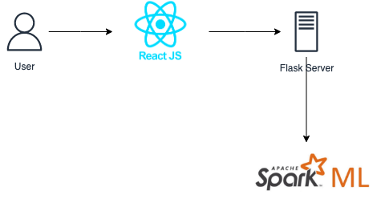

# CSGY-6513-Backend

### Prepare Database
We use mongodb as the main database. So please make sure there is a mongodb server running on your machine.(Of course you can upgrade it into a mongo cloud service, which depends on the scale of our data)

Before we actually launch the predicting server, we should pull data through the data center and store it in the mongodb.

```bash
> cd mongo
> ./load_data.sh
```


### Prepare Environment

Python: 3.7

Java: 8

Spark: 2.4.7

Kafka: kafka_2.13-3.1.0

Mongodb: 5.0.3

#### Python

```bash
> pip install -r requirements.txt
```

#### Java

```bash
> export JAVA_HOME=#{your java directory}
```

#### Spark

```bash
> export SPARK_HOME=#{your spark directory}
```

#### Kafka

```bash
> cd #{your kafka directory}
> bin/zookeeper-server-start.sh config/zookeeper.properties #luanch zookeeper for kafka broker coordination
```

start a new terminal

```bash
> bin/kafka-server-start.sh config/server.properties
```


### Architecture

#### Single Prediction



#### Batch Prediction


### API Design

#### Kafka Message

- Task(Pending/Predicting)

```json
{
  "task_id": "934123916882940396",
  "status": 1,
  "input_list": [ 
    [ 0.00632, 18, 2.31, 0, 0.538, 6.575, 65.2, 4.09, 1, 296, 15.3, 396.9, 4.98 ], 
    [ 0.02731, 0, 7.07, 0, 0.469, 6.421, 78.9, 4.9671, 2, 242, 17.8, 396.9, 9.14 ],
  ]
}
```

- Task succeeded

```json
{
  "task_id": "934123916882940396",
  "status": 0,
  "input_list": [ 
    [ 0.00632, 18, 2.31, 0, 0.538, 6.575, 65.2, 4.09, 1, 296, 15.3, 396.9, 4.98 ], 
    [ 0.02731, 0, 7.07, 0, 0.469, 6.421, 78.9, 4.9671, 2, 242, 17.8, 396.9, 9.14 ],
  ],
  "prediction": [
    30.025022480537096,
    25.471234598995597,
  ]
}
```

